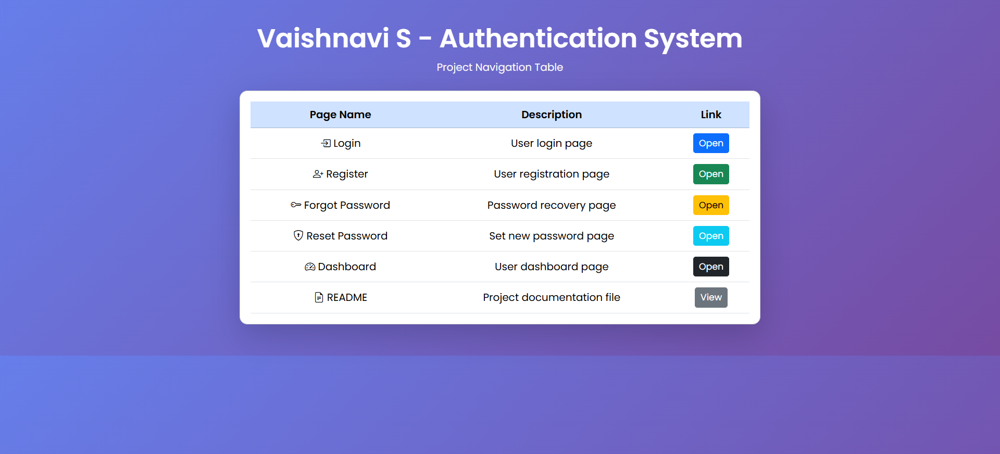
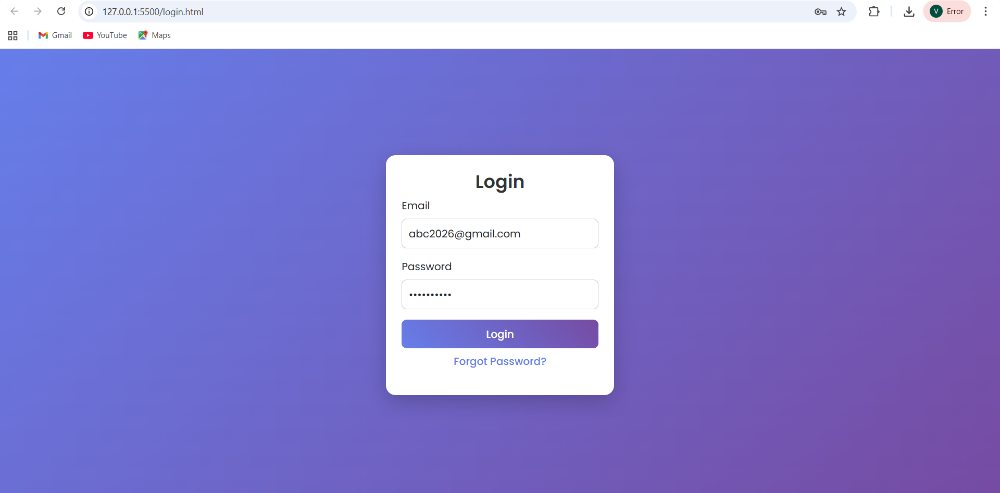
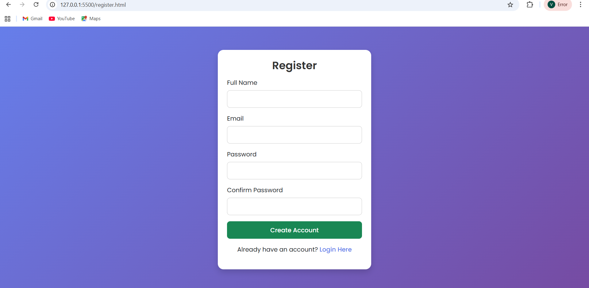
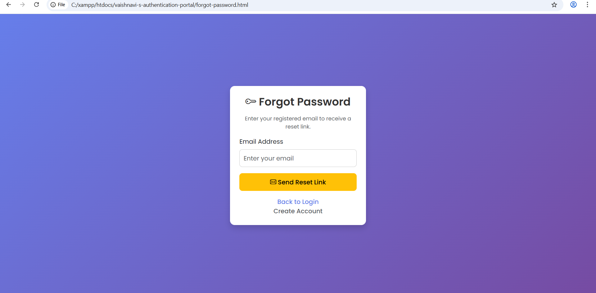
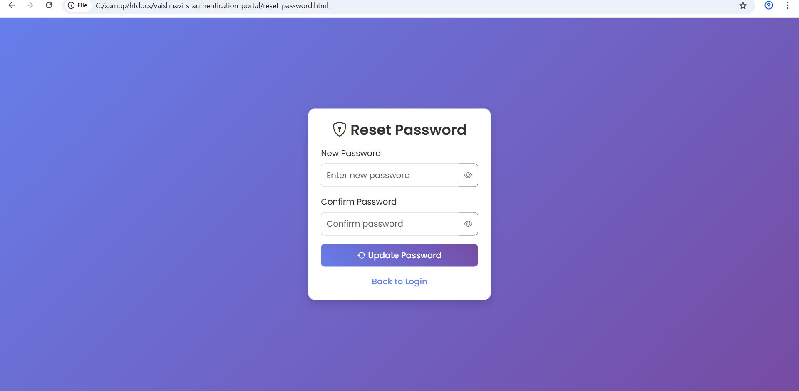
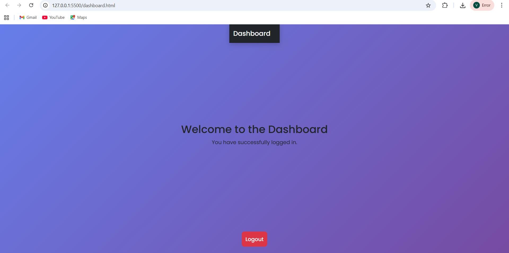

# Authentication System Styling

## Project Overview

This project is a simple Authentication System developed using HTML, CSS, and Bootstrap 5. It includes multiple pages such as Login, Registration, Forgot Password, Reset Password, and Dashboard.

The main objective of this project is to transform basic HTML pages into a clean, responsive, and professional-looking web application using Bootstrap and custom CSS.

This project demonstrates how front-end technologies can be used to design an organized and user-friendly interface for authentication systems. It also focuses on responsiveness so that the application works smoothly across desktops, laptops, tablets, and mobile devices.

## Technologies Used

The following technologies were used in this project:

1. HTML – Used to create the structure of web pages  
2. CSS – Used for styling and layout design  
3. Bootstrap 5 – Used for responsive design and components such as cards, forms, buttons, and navbar  
4. Google Fonts – Used to enhance typography and visual appearance.

## Pages Description

### Index Page

The index page allows users to navigate between different pages of the authentication system. It uses a Bootstrap card layout with a responsive table that displays page names, descriptions, and quick access links for each section.

### Login Page  
  
The login page allows users to enter their email and password to access the system. It uses a Bootstrap card layout with styled input fields and includes a "Forgot Password" link.

### Registration Page  
  
The registration page allows new users to create an account by entering their details such as full name, email, password, and confirm password.

### Forgot Password Page  
  
This page allows users to enter their registered email to request a password reset.

### Reset Password Page  
  
This page allows users to set a new password after requesting a reset. It includes password visibility toggle functionality.

### Dashboard Page  
  
The dashboard page is displayed after successful login. It includes a welcome message, navigation bar, and logout option.

## Features

This project includes the following features:

1. Responsive design using Bootstrap 5  
2. Clean and modern UI using card layouts  
3. Styled forms with proper spacing  
4. Navigation between all pages  
5. Password visibility toggle feature  
6. Custom CSS for enhanced appearance  
7. Mobile-friendly design  
8. Organized and user-friendly interface  

## Folder Structure
authentication-system-styled/
│
├── login.html
├── register.html
├── forgot-password.html
├── reset-password.html
├── dashboard.html
├── style.css
├── README.md
└── screenshots/

## Screenshots

All page screenshots (Login, Register, Forgot Password, Reset Password, Dashboard) are available in the **screenshots** folder.

## Conclusion

This project helped in understanding how to design responsive web pages using Bootstrap. It also improved skills in structuring multi-page applications and enhancing UI using modern front-end technologies.

## Author

**Vaishnavi S**